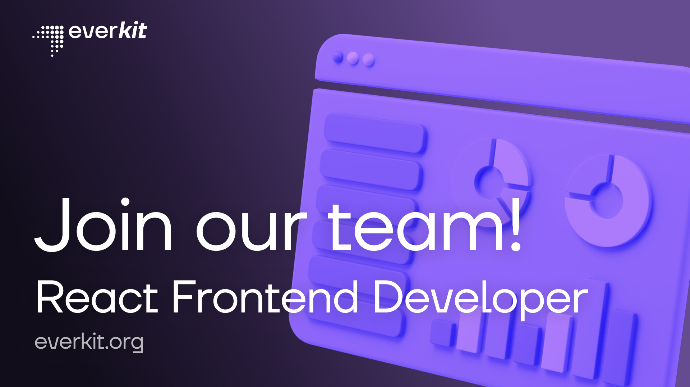

# EverKit | React Frontend Developer Vacancy Task

## Task

1. Сделать fork проекта к себе в github
2. Сверстать сайт с сайдбар-меню и списком карточек-монет
   1. [Ссылка на дизайн в Figma](https://www.figma.com/file/hN5zMa5y5waJodthhXQeI6/EverKit-Frontend-Developer-Task)
   2. Сайт состоит из трех страниц:
      1. Список токенов
      2. Поиск (без реализации, только переход)
      3. Токен (без реализации, только переход)
   3. Представьте, что это реальный проект и вам нужно организовать его структуру, базовые компоненты и дальнейшую верстку
   4. Можно добавлять в проект любые библиотеки
   5. Запросы к API для получения данных упрощаются до импорта из файлов `tokens.ts` и `menu.tsx`
3. На что мы обратим внимание при проверке:
   1. Верстка и стили
   2. Разделение на компоненты и организацию базовых компонентов/стилей
   3. Функциональный стиль в приоритете над классовым
4. Реализация адаптивности не обязательна, но приветствуется. Попробуйте придумать самостоятельно, как она должна работать (куда и когда спрячется меню, как будут отображены карточки)
5. Осуществить деплой проекта любым удобным для вас способом
6. Прислать в форму заявки ссылки на github и сайт

## Available Scripts

This project was bootstrapped with [Create React App](https://github.com/facebook/create-react-app).

In the project directory, you can run:

### `npm start`

Runs the app in the development mode.\
Open [http://localhost:3000](http://localhost:3000) to view it in your browser.

The page will reload when you make changes.\
You may also see any lint errors in the console.

### `npm run build`

Builds the app for production to the `build` folder.\
It correctly bundles React in production mode and optimizes the build for the best performance.

The build is minified and the filenames include the hashes.\
Your app is ready to be deployed!

See the section about [deployment](https://facebook.github.io/create-react-app/docs/deployment) for more information.
